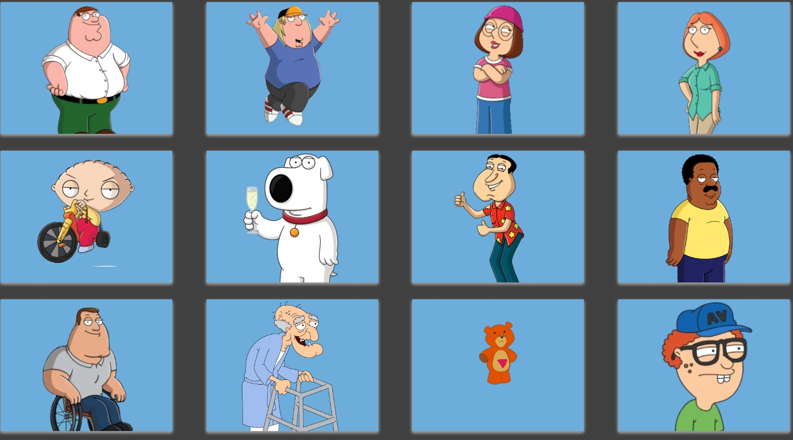

### Premise

Clicky Game is a web app that utilizes React for the front end. It keeps a score of the user, and restarts the score when the user clicks on the image more than once.This memory game was created using React. I wanted to break up my application's UI into components, manage component state, and respond to user events.

## Game Obective

This application renders different images on screen that get reshuffled each time they are clicked. The user's score increments when the image is not selected more than twice, and if it is cliced twice, the user loses. The top score is 12 (number of cartoon character). The user's score will reset to 0 if the same image is selected more than once.

`GOOD LUCK`

### Deployment

This app was deployed to Heroku and can be accessed here:https://el-clicky.herokuapp.com/

### Screenshot

